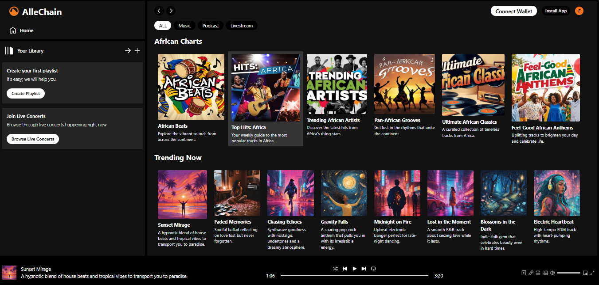
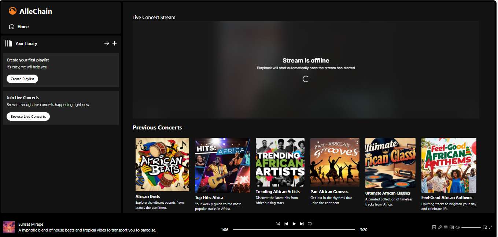

# **AlleChain**

 
**AlleChain** is a groundbreaking decentralized streaming platform that leverages **Livepeer** to provide real-time livestreaming capabilities for **independent artists, podcasters, and content creators**. By integrating blockchain technology, AlleChain ensures transparent transactions, fair artist compensation, and direct fan engagement through NFTs and tokenized support mechanisms. Our mission is to revolutionize how creators and fans connect, creating a secure, scalable, and engaging platform for audio lovers worldwide.

### Key Features:
- **Music streaming** for independent artists.
- **Podcast hosting** with built-in audience interaction tools.
- **Livestreaming events** for performances, powered by Livepeer for real-time fan engagement.
- **NFTs** for exclusive content.
- **Tokenized tipping system** to support artists directly.

---
## Main Product - Live Concerts
Experience live concerts directly through the platform. Fans can attend virtual events and support their favorite artists by purchasing tickets and tokens. This feature aims to revolutionize how fans engage with live performances.

### Target Audience:
- **Independent artists** seeking visibility and fair compensation in Africa.
- **Podcasters** looking for decentralized platforms with fewer restrictions.
- **Fans and music lovers** looking for unique content and ways to support their favorite creators.
- **Event organizers** interested in livestreaming concerts and performances.

---
### Competitive Advantage:
- **Decentralized architecture** for transparent and scalable streaming.
- **Lower fees** for creators compared to traditional platforms.
- **Tokenized economy** and NFTs to offer fans ownership of exclusive moments.

---
## 3. Vision and Mission  
**Vision:**  
To create a world where **music, podcasts, and live performances** transcend borders through **decentralization**, fostering direct connections between creators and their audiences.

**Mission:**  
To provide **independent creators** with a fair, secure, and engaging platform that offers **uninterrupted streaming, transparent monetization, and community-driven support.**

---

## 4. Product and Service Offerings  
### 1. **Music Streaming**  
- A space for independent artists to share and monetize their music.  
- **Custom playlists and discovery features** to enhance user experience.

### 2. **Podcast Hosting**  
- Seamless hosting for podcasters with **monetization options** (ads and donations).  
- Interactive features like **live Q&A** and listener polls.

### 3. **Livestreaming Performances**  
- Real-time performances with **integrated fan tipping and chat features**, powered by **Livepeer**.  
- **On-demand playback** for missed events.

### 4. **Tokenized Tipping System**  
- Fans support artists directly through a **token system** for tipping or voting.  
- Tokens can also unlock exclusive content or merchandise discounts.

### 5. **Live Concert Access**  
- Fans can pay to attend live concerts using tokens, connecting their wallets for seamless payment processing.

---

## 5. Revenue Model  
1. **Subscription Plans:**  
   - Free tier with ads and premium, ad-free plans for listeners.  
   - Premium users unlock high-quality streaming and exclusive content.

2. **Transaction Fees:**  
   - A **small commission** on token transactions.

3. **Tipping System:**  
   - Fans can purchase tokens and tip artists or creators during live streams.

4. **Sponsored Content:**  
   - Ad placements for podcasts and music.

5. **Event Tickets:**  
   - Livestreamed events may have paid ticket options for exclusive access.

---

## 6. Technology Stack  
- **Frontend:** Built with **React.js** for a dynamic user interface.  
- **Styling:** Utilizes **Tailwind CSS** for responsive design.  
- **Streaming Infrastructure:** Powered by **Livepeer** for decentralized, scalable livestreaming.  
- **Blockchain:** Smart contracts on Ethereum manage transactions and ownership.

---

## 7. Marketing Strategy  
### 1. **Social Media Campaigns:**  
- Launch awareness campaigns on Twitter, Instagram, and TikTok.  
- Collaborate with micro-influencers and content creators.

### 2. **Community Building:**  
- Host regular **livestreamed events** and AMA sessions to engage with users.  
- Launch a **referral program** with incentives for new users.

### 3. **Partnerships with Festivals and Events:**  
- Partner with music festivals and independent venues to **livestream concerts**.

### 4. **Token Drops and Limited Content:**  
- Collaborate with artists on **exclusive token drops** to generate buzz.

### 5. **Content Creator Incentives:**  
- Offer early creators **discounts on platform fees** or **free tokens** for top performers.

---

## 8. Operations Plan  
### Key Activities:
- **Platform Development:** Build and maintain the web and mobile applications.  
- **Creator Onboarding:** Collaborate with artists and podcasters to bring them onto the platform.  
- **Content Moderation:** Ensure all uploaded content meets community guidelines.  
- **Customer Support:** Provide 24/7 support for users and creators.

---

## 10. Risks and Challenges  
1. **Competition:** Competing with giants like Spotify and YouTube.  
2. **Adoption of Blockchain Technology:** Educating users and artists on blockchain and tokens.  
3. **Regulatory Risks:** Navigating copyright and licensing laws.  
4. **Platform Security:** Ensuring the platform remains secure from cyber-attacks.  

---
## 🚀 Project Roadmap

### Phase 1: Project Initialization
- **Setup Project Structure**
### Phase 2: User Interface Development
- **UI Design and Implementation**

### Phase 3: Core Features Development
- **Live Streaming Integration for Concerts, Music, and Podcasts**  
  (Main product that allows users to stream live concerts and podcasts)
- **Token Support for Fans**
- **Playlist Creation for Users**
- **Wallet Integration**
- **Smart Contract Development**

### Phase 4: Integration
- **Video Streaming Setup**
- **Wallet Integration**
- **Smart Contract Development**

### Phase 5: User and Artist Onboarding
- **Onboarding Process for Users and Artists**

### Phase 6: Testing and Optimization
- **Quality Assurance Testing**

### Phase 7: Launch Preparation
- **Final Adjustments**
- **Marketing Strategy Development**

### Phase 8: Launch
- **Official Launch of Allechain**

### Phase 9: Post-Launch and Future Enhancements
- **User Feedback Collection**
- **Feature Expansion**

import React, { useState } from "react";
import { Wallet, Mail, LogIn, Lock, Eye, EyeOff } from "lucide-react";
import { useNavigate } from "react-router-dom";
import { FaGoogle } from "react-icons/fa";
import { ConnectWallet } from "@thirdweb-dev/react"; // Import Thirdweb's ConnectButton

const Login = () => {
  const [isLogin, setIsLogin] = useState(true);
  const [showPassword, setShowPassword] = useState(false);
  const [formData, setFormData] = useState({
    email: "",
    password: "",
    confirmPassword: "",
  });

  const navigate = useNavigate(); // Initialize navigate function

  const handleSubmit = (e) => {
    e.preventDefault();
    // Handle form submission
    console.log("Form submitted:", formData);

    // Redirect to the /player page after form submission
    navigate("/player");
  };

  const handleInputChange = (e) => {
    const { name, value } = e.target;
    setFormData((prev) => ({
      ...prev,
      [name]: value,
    }));
  };

  return (
    

      {/* Left Side - Auth Form */}
      

        

          

            <h2 className="mt-6 text-3xl font-bold text-gray-900">
              {isLogin ? "Welcome back" : "Create an account"}
            </h2>
            

              {isLogin ? "Don't have an account? " : "Already have an account? "}
              <button
                onClick={() => setIsLogin(!isLogin)}
                className="font-medium text-orange-600 hover:text-orange-500"
              >
                {isLogin ? "Sign up" : "Sign in"}
              </button>
            

          

          <form className="mt-8 space-y-6" onSubmit={handleSubmit}>
            

              

                

                  <Mail className="absolute left-3 top-1/2 transform -translate-y-1/2 h-5 w-5 text-gray-400" />
                  <input
                    name="email"
                    type="email"
                    required
                    value={formData.email}
                    onChange={handleInputChange}
                    className="pl-10 w-full px-3 py-2 border border-gray-300 rounded-lg focus:outline-none focus:ring-2 focus:ring-orange-500"
                    placeholder="Email address"
                  />
                

              

              

                

                  <Lock className="absolute left-3 top-1/2 transform -translate-y-1/2 h-5 w-5 text-gray-400" />
                  <input
                    name="password"
                    type={showPassword ? "text" : "password"}
                    required
                    value={formData.password}
                    onChange={handleInputChange}
                    className="pl-10 w-full px-3 py-2 border border-gray-300 rounded-lg focus:outline-none focus:ring-2 focus:ring-orange-500"
                    placeholder="Password"
                  />
                  <button
                    type="button"
                    onClick={() => setShowPassword(!showPassword)}
                    className="absolute right-3 top-1/2 transform -translate-y-1/2"
                  >
                    {showPassword ? (
                      <EyeOff className="h-5 w-5 text-gray-400" />
                    ) : (
                      <Eye className="h-5 w-5 text-gray-400" />
                    )}
                  </button>
                

              

              {!isLogin && (
                

                  

                    <Lock className="absolute left-3 top-1/2 transform -translate-y-1/2 h-5 w-5 text-gray-400" />
                    <input
                      name="confirmPassword"
                      type={showPassword ? "text" : "password"}
                      required
                      value={formData.confirmPassword}
                      onChange={handleInputChange}
                      className="pl-10 w-full px-3 py-2 border border-gray-300 rounded-lg focus:outline-none focus:ring-2 focus:ring-orange-500"
                      placeholder="Confirm Password"
                    />
                  

                

              )}
            

            {isLogin && (
              

                <button
                  type="button"
                  className="text-sm font-medium text-orange-600 hover:text-orange-500"
                >
                  Forgot your password?
                </button>
              

            )}

            <button
              type="submit"
              className="w-full flex justify-center py-2 px-4 border border-transparent rounded-lg shadow-sm text-sm font-medium text-white bg-black focus:outline-none focus:ring-2 focus:ring-offset-2 focus:ring-indigo-500"
            >
              {isLogin ? "Sign in" : "Create Account"}
            </button>
          </form>
        

      

      {/* Right Side - Alternative Auth Methods */}
      

        

          

            <h2 className="text-3xl font-bold">Quick Access</h2>
            

              Connect instantly with your preferred method
            

          

          

            <ConnectWallet
              className="w-full max-w-xs flex items-center justify-center gap-3 px-4 py-3 border-2 border-white rounded-lg hover:bg-white hover:text-black transition-colors duration-200"
            >
              <Wallet className="h-5 w-5" />
              Connect Wallet
            </ConnectWallet>

            <button
              type="button"
              className="w-full max-w-xs flex items-center justify-center gap-3 px-4 py-3 border-2 border-white rounded-lg hover:bg-white hover:text-black transition-colors duration-200"
            >
              <FaGoogle className="h-5 w-5" />
              Continue with Google
            </button>
          

        

      

    

  );
};

export default Login;