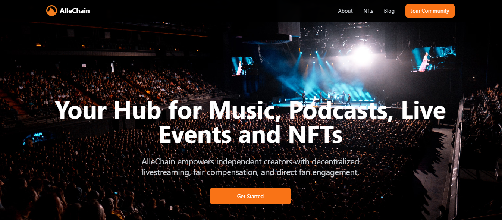
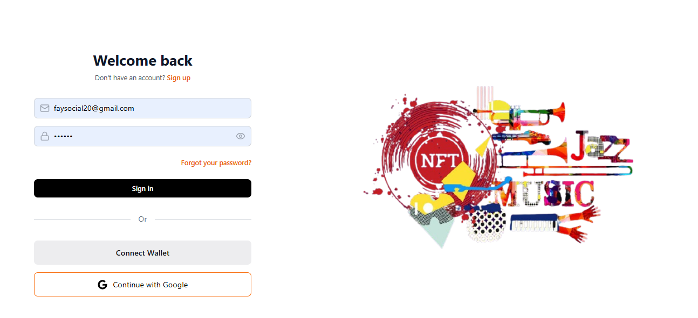
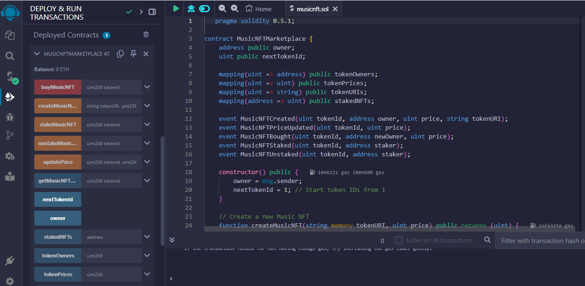
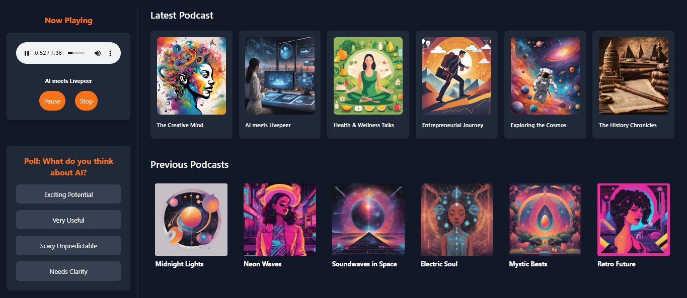
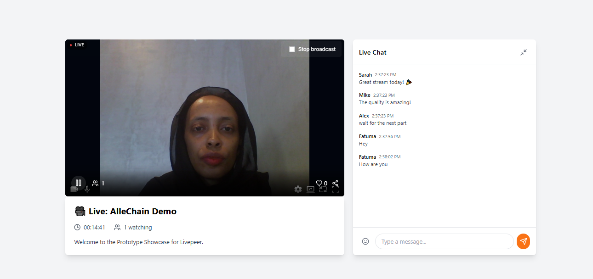
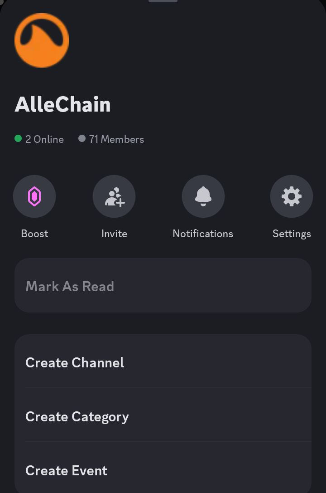

# **AlleChain**


**AlleChain** is a groundbreaking decentralized streaming platform that leverages **Livepeer** to provide real-time livestreaming capabilities for **independent artists, podcasters, and content creators**. By integrating blockchain technology, AlleChain ensures transparent transactions, fair artist compensation, and direct fan engagement through NFTs and tokenized support mechanisms. Our mission is to revolutionize how creators and fans connect, creating a secure, scalable, and engaging platform for audio lovers worldwide.

---
## Features

- **Music & Podcast Hub**: Discover independent music and podcasts. Fans can purchase NFTs for exclusive content and support their favorite creators by staking tokens.
- **Livestreaming**: Enjoy live performances, podcasts, and interactive events with chat features for real-time fan engagement.
- **Tokenization**: Artists and creators benefit from a new revenue model through NFTs and staking, offering fans ownership and rewards.

---

## Pages Overview

## **Landing Page**

  
**Start your journey with AlleChain** – A decentralized platform for music, podcasts, and live streaming.

---

## 2. Login Page

After clicking the **Get Started** button on the landing page, users are directed to the **Login Page**, where they can log in or sign up to access the platform.

 

### Login Options:
The login page provides three login options:

1. **Email and Password**: Users can enter their email address and password to log in.
2. **Continue with Google**: For users who prefer quick access, they can log in using their Google account.
3. **Connect Wallet**: Users can choose to connect their cryptocurrency wallet for authentication.

---

## **Main Menu**
Once logged in, you'll be directed to the main menu, 
 

Where you can access the following:

**Music Page**  
The music page in this prototype envisions a dynamic space for music lovers to explore a wide range of tracks from independent artists. Users would have the opportunity to discover fresh sounds, uncover new talent, and enjoy music across diverse genres. This feature would allow fans to connect with the music they love while supporting emerging artists, all within a user-friendly interface designed for seamless discovery.

 

## Tokenization & Smart Contracts

We tested our smart contracts using **Remix IDE**, which allowed us to simulate and verify the contract behavior in a secure environment before deploying it to the Ethereum network. The contracts were thoroughly tested for key features, including:

- **NFT Creation**: Users can mint new Music NFTs by providing metadata (URI) and setting a price.
- **NFT Trading**: Securely buy and sell NFTs with transparent ownership transfer and pricing mechanisms.
- **NFT Staking**: Users can stake their NFTs for added utility and unstake them when required.
- **Detailed NFT Metadata**: Access detailed information about NFTs, including ownership, price, and metadata URI.

## Live Music NFTs

Live Music NFTs revolutionize the way fans and artists interact by offering unique digital assets tied to live performances. Key features include:

- **Exclusive Concert Access**:
  - NFT tickets for live concerts, which are tamper-proof and transferable.
  - Limited-edition VIP passes that grant access to backstage tours or meet-and-greet events.

- **Recorded Live Performances**:
  - Tokenized recordings of unique live performances, such as acoustic sets or remixes.
  - Personalized NFTs with dedications or messages from the artist.

- **Fan Engagement**:
  - Fan badges as proof of attendance, unlocking perks like discounts, merchandise, or presale access.
  - NFTs granting access to virtual or metaverse live music events.

- **Collectibles**:
  - Limited-edition digital merchandise, such as artwork, animations, or posters.
  - Iconic moments from live performances captured and tokenized as NFTs.

- **Revenue Sharing**:
  - NFTs tied to royalties from live recordings, allowing fans to share in the artist's success.
  - Charity auctions for special live music NFTs.

- **Artist Support**:
  - Pre-sale NFTs to fund tours or event production.
  - Tour-specific NFTs encouraging fans to collect exclusive sets.

   


---- 


**Podcast Page**  
The podcast page in this prototype offers an envisioned space for podcast lovers to explore a broad selection of shows across various genres. Users would have the opportunity to browse through the latest episodes from both independent creators and well-known voices, discovering new content to match their interests. Whether it’s deep discussions on current events, engaging storytelling, or light-hearted banter, the page would aim to provide something for everyone.
 

The page also includes a feature for Polls, where listeners would be able to participate in discussions related to the podcasts they're listening to. This would allow fans to share their opinions on the content, creating a sense of community and giving them an active role in the conversation. This feature is designed to bring listeners closer to the content and the creators, offering an interactive experience where feedback and engagement are valued. While these features are part of the prototype, they highlight the direction the platform is headed in, aiming to create a more interactive and engaging podcast experience in the future.
  

**Livestream Page**  
   - **Live Events**: Watch live performances from your favorite artists and creators.
   - **Chat Feature**: Engage with creators and fellow fans via live chat.
    

---

---
# **Community Building**

## 1. **Join AlleChain Community**  
 Joining the community connects you to exciting updates, exclusive content, and opportunities to shape the platform's future.  

- **Discord**: [Join our Discord Community](https://discord.gg/zK6WmfnXdb) to chat in real time, participate in discussions, and stay updated.
   
- **X (formerly Twitter)**: [Follow us on Twitter](https://x.com/AlleChain) for announcements, artist showcases, and engaging polls.  
- **Email Updates**: Sign up for [exclusive email updates](https://allechain.netlify.app/) to get first-hand information on upcoming events,and platform features.  

---

## Installation and Usage

To run the project locally, follow these steps:

### Prerequisites

- [Node.js](https://nodejs.org/) (Recommended version: 14.x or above)
- [npm](https://www.npmjs.com/get-npm)
- A Livepeer API key (for streaming)
- Thirdweb Client ID (for NFT integration)

### Steps to Setup

1. **Clone the repository:**
   ```bash
   git clone https://github.com/Fatumayattani/allechain_livepeer.git
   cd allechain_livepeer
   ```

2. **Install dependencies:**
   ```bash
   npm install
   ```

3. **Run the development server:**
   ```bash
   npm run dev
   ```

   The app will be available at `http://localhost:5173`.

