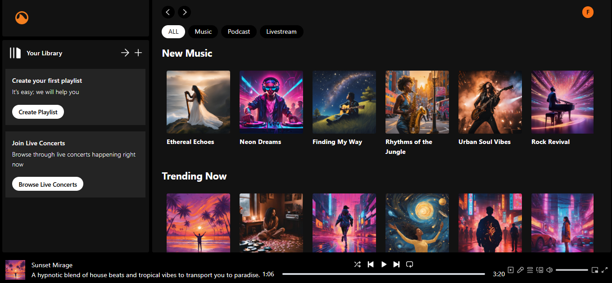

# **AlleChain**

**AlleChain** is a groundbreaking decentralized streaming platform that leverages **Livepeer** to provide real-time livestreaming capabilities for **independent artists, podcasters, and content creators**. By integrating blockchain technology, AlleChain ensures transparent transactions, fair artist compensation, and direct fan engagement through NFTs and tokenized support mechanisms. Our mission is to revolutionize how creators and fans connect, creating a secure, scalable, and engaging platform for audio lovers worldwide.

---
## Features

- **Music & Podcast Hub**: Discover independent music and podcasts. Fans can purchase NFTs for exclusive content and support their favorite creators by staking tokens.
- **Livestreaming**: Enjoy live performances, podcasts, and interactive events with chat features for real-time fan engagement.
- **Tokenization**: Artists and creators benefit from a new revenue model through NFTs and staking, offering fans ownership and rewards.

---

## Tokenization & Smart Contracts
We tested our smart contracts using **Remix IDE**, a powerful tool for Ethereum contract development. Remix helped us simulate and verify the contract behavior in a secure environment before deploying it to the Ethereum network. The contract was thoroughly tested for key features like:

- **NFT creation**: Ensuring the minting process for music and podcast NFTs works as expected.
- **Token staking**: Verifying that tokens can be staked and unstaked correctly.
- **Transactions**: Ensuring safe and secure transfers of NFTs between users.

 

---

## Pages Overview

## **Landing Page**

  
**Start your journey with AlleChain** – A decentralized platform for music, podcasts, and live streaming.

---

## 2. Login Page

After clicking the **Get Started** button on the landing page, users are directed to the **Login Page**, where they can log in or sign up to access the platform.

 

### Login Options:
The login page provides three login options:

1. **Email and Password**: Users can enter their email address and password to log in.
2. **Continue with Google**: For users who prefer quick access, they can log in using their Google account.
3. **Connect Wallet**: Users can choose to connect their cryptocurrency wallet for authentication.

---

## **Main Menu**
Once logged in, you'll be directed to the main menu, 
 

Where you can access the following:

**Music Page**  
The music page in this prototype envisions a dynamic space for music lovers to explore a wide range of tracks from independent artists. Users would have the opportunity to discover fresh sounds, uncover new talent, and enjoy music across diverse genres. This feature would allow fans to connect with the music they love while supporting emerging artists, all within a user-friendly interface designed for seamless discovery.

 

Additionally, the page would offer the chance to engage with exclusive music NFTs, allowing users to purchase and stake unique digital collectibles tied to their favorite tracks and artists. This feature aims to provide an innovative way for fans to invest in music and support their favorite creators in a new, blockchain-driven way. While these features are part of the prototype and not yet available, they reflect the platform’s potential to revolutionize how fans interact with music. The music page is designed to offer an immersive and engaging experience for all music enthusiasts, blending content discovery with innovative engagement opportunities.

---- 

**Podcast Page**  
The podcast page in this prototype offers an envisioned space for podcast lovers to explore a broad selection of shows across various genres. Users would have the opportunity to browse through the latest episodes from both independent creators and well-known voices, discovering new content to match their interests. Whether it’s deep discussions on current events, engaging storytelling, or light-hearted banter, the page would aim to provide something for everyone.
 

The page also includes a feature for Polls, where listeners would be able to participate in discussions related to the podcasts they're listening to. This would allow fans to share their opinions on the content, creating a sense of community and giving them an active role in the conversation. This feature is designed to bring listeners closer to the content and the creators, offering an interactive experience where feedback and engagement are valued. While these features are part of the prototype, they highlight the direction the platform is headed in, aiming to create a more interactive and engaging podcast experience in the future.
  

**Livestream Page**  
   - **Live Events**: Watch live performances from your favorite artists and creators.
   - **Chat Feature**: Engage with creators and fellow fans via live chat.

---

## **Target Audience**
- **Independent artists** seeking visibility and fair compensation in Africa.
- **Podcasters** looking for decentralized platforms with fewer restrictions.
- **Fans and music lovers** looking for unique content and ways to support their favorite creators.
- **Event organizers** interested in livestreaming concerts and performances.

---

## **Competitive Advantage**
- **Decentralized architecture** for transparent and scalable streaming.
- **Lower fees** for creators compared to traditional platforms.
- **Tokenized economy** and NFTs to offer fans ownership of exclusive moments.
---

## **Revenue Model**  

1. **Subscription Plans**  
   - Free tier with ads and premium, ad-free plans for listeners.  
   - Premium users unlock high-quality streaming and exclusive content.

2. **Transaction Fees**  
   - A **small commission** on token transactions.

3. **Tipping System**  
   - Fans can purchase tokens and tip artists or creators during live streams.

4. **Sponsored Content**  
   - Ad placements for podcasts and music.

5. **Event Tickets**  
   - Livestreamed events may have paid ticket options for exclusive access.

---

## **Technology Stack**  

- **Frontend**: Built with **React.js** for a dynamic user interface.  
- **Styling**: Utilizes **Tailwind CSS** for responsive design.  
- **Streaming Infrastructure**: Powered by **Livepeer** for decentralized, scalable livestreaming.  
- **Blockchain**: Smart contracts on Ethereum manage transactions and ownership.

---

## **Marketing Strategy**  

### 1. **Social Media Campaigns**  
- Launch awareness campaigns on Twitter, Instagram, and TikTok.  
- Collaborate with micro-influencers and content creators.

### 2. **Community Building**  
- Host regular **livestreamed events** and AMA sessions to engage with users.  
- Launch a **referral program** with incentives for new users.

### 3. **Partnerships with Festivals and Events**  
- Partner with music festivals and independent venues to **livestream concerts**.

### 4. **Token Drops and Limited Content**  
- Collaborate with artists on **exclusive token drops** to generate buzz.

### 5. **Content Creator Incentives**  
- Offer early creators **discounts on platform fees** or **free tokens** for top performers.

---
# **Community Building**

## 1. **Join the AlleChain Community**  
Become a part of the vibrant **AlleChain family**, where fans, artists, and collectors collaborate to transform music and NFTs. Joining the community connects you to exciting updates, exclusive content, and opportunities to shape the platform's future.  

- **Discord**: [Join our Discord Community](#) to chat in real time, participate in discussions, and stay updated.  
- **X (formerly Twitter)**: [Follow us on Twitter](#) for announcements, artist showcases, and engaging polls.  
- **Email Updates**: Sign up for [exclusive email updates](#) to get first-hand information on upcoming events, token drops, and platform features.  

---

## 2. **Upcoming Features and Activities**  
Our vision is to grow the **AlleChain community** into the ultimate destination for music lovers and creators. Here’s what we’re building to make it happen:  

- **Live Q&A Sessions with Artists**: Connect with your favorite creators through interactive AMAs.  
- **Fan Contests and Challenges**: Compete in remix battles, fan art contests, and creative challenges to win exclusive rewards.  
- **Referral Program**: Invite friends to join AlleChain and earn special perks for growing the community.  
- **Spotlight Opportunities**: Celebrate top contributors, artists, and fans in exclusive features.  

---

## 3. **Why Join the AlleChain Community?**  
Becoming a part of **AlleChain’s community** is more than just joining a platform—it’s joining a movement.  

- **Shape the Future**: Your feedback directly influences the platform’s growth and direction.  
- **Exclusive Perks**: Enjoy early access to platform features, token drops, and community-only events.  
- **Meaningful Connections**: Network with like-minded individuals who are passionate about music, NFTs, and innovation.  

